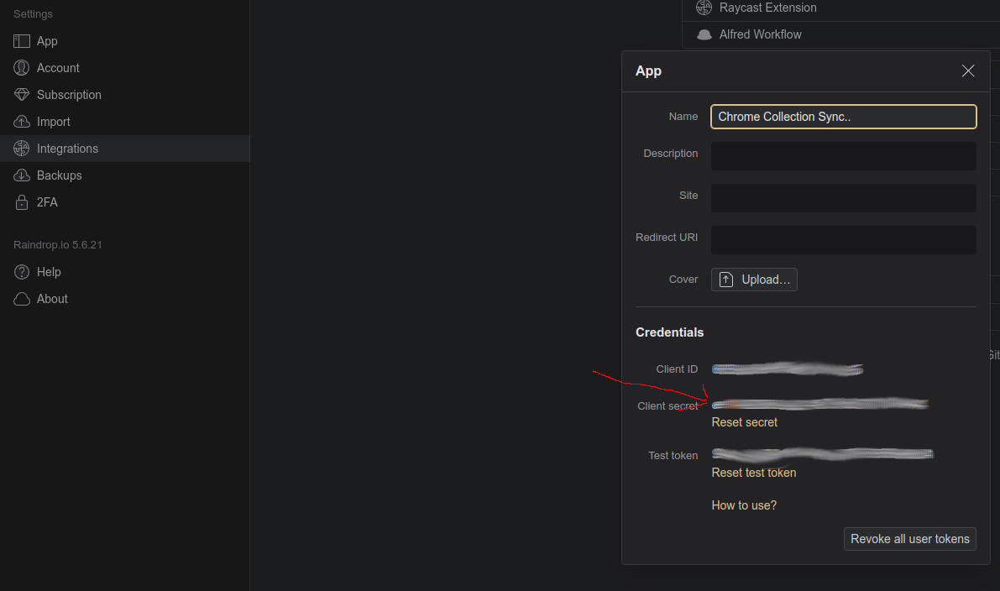
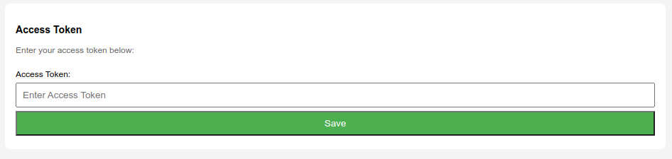
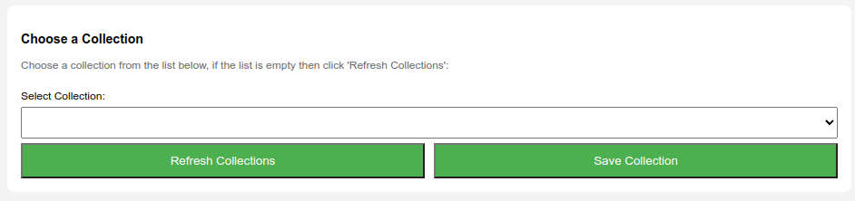
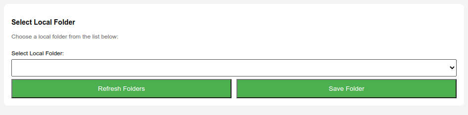
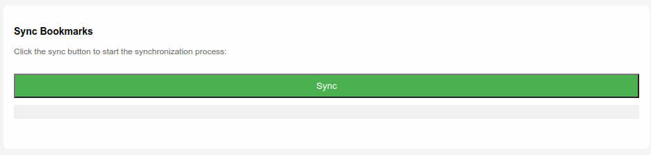

# Raindrop-Sortof-Sync

Raindrop-Sortof-Sync is a Chrome extension designed to facilitate the transfer of Raindrops from a Raindrop.io collection to a local bookmark folder in your browser. 

**Development Status:** For my use case I consider this extension to be complete, I have no intention to commit the time to making it a full sync application, if people use it and find bugs I will do my best to fix them.

**Important Note:**
- This extension operates with a developer authentication mechanic to keep the setup simple.

**Warning:**
- The sync process is destructive to the folder you select. It will clear out everything in the selected folder before bringing across items from the chosen Raindrop.io collection.
  - **Please take a backup of your bookmarks or just be careful before initiating the sync.**

## Features

- Copy Raindrops from a Raindrop.io collection to a local bookmark folder.
- Rate limiting to comply with Raindrop.io's rate limits.

## Known Bugs

- The text that updates during sync to inform about the ongoing process may not run correctly at the end of the fetching process.

## Setting Up Raindrop-Sortof-Sync Chrome Extension

1. **Raindrop.io Integration Setup:**
   - Log in to Raindrop.io and navigate to your account settings.
   - Click on 'Integrations' and in the 'For Developers' seciton create a new App and give it a random name
   - Copy the Client Secret.
     

2. **Extension Options:**
   - Install the extension in Chrome
   - Pin the extension to the taskbar and right-click and select options.

3. **Client Secret Configuration:**
   - Paste the Client Secret into the Access Token box.
     

4. **Select Raindrop Collection:**
   - Click 'Refresh Collections' to view your Raindrop.io collections.
   - Choose a collection and click 'Save Collection.'
     

5. **Select Local Bookmark Folder:**
   - In the 'Select Local Folder' box, click 'Refresh Folders.'
   - Choose the desired local folder for your bookmarks.
   - Click 'Save Folder.'
     

6. **Sync Bookmarks:**
   - In the 'Sync Bookmarks' section, press the 'Sync' button.
   - This action is destructive and will clear the selected folder before bringing in items from the chosen Raindrop.io collection.
     

**Note:** Ensure the accuracy of your actions as this process will remove all folders and bookmarks from your local folder

## Bug Reporting

If you encounter any issues or bugs, please report them on the GitHub issue page.

## License
TODO - Actually do the license bits here
This project is licensed under the [MIT License](LICENSE.md).